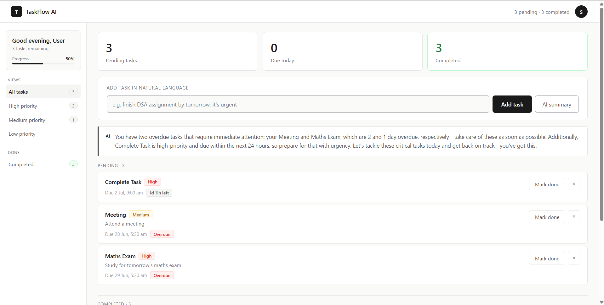
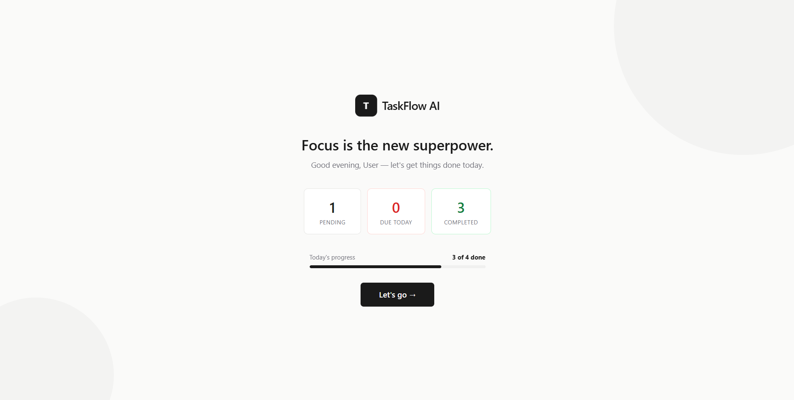

# TaskFlow AI — AI-Powered Task Manager

> Add tasks in natural language. AI extracts, prioritizes, and summarizes them for you.



---

## What is this?

TaskFlow AI is a full-stack web application where users can manage tasks using plain English. Instead of filling forms, you type something like *"finish the DSA assignment by tomorrow, it's urgent"* — and the AI automatically extracts the task title, sets the priority to High, calculates tomorrow's date, and saves it. A live countdown timer shows exactly how much time is left for each task.

---

## Features

- **Natural language task input** — type anything, AI does the rest
- **AI-powered prioritization** — automatically sets High / Medium / Low priority
- **Smart due date & time extraction** — understands "tomorrow", "next Monday", "at 8pm"
- **Live countdown timer** — ticks down second by second per task
- **Overdue detection** — tasks past due are flagged instantly
- **AI daily focus summary** — generates a motivating summary of your pending tasks, mentioning overdue and urgent items by name
- **Priority filters** — filter tasks by High / Medium / Low in the sidebar
- **Mark complete / Delete** — full task lifecycle management
- **Toast notifications** — instant feedback on every action
- **Animated welcome screen** — motivational greeting with live task stats and progress bar on every reload
- **Clean minimal UI** — professional light theme, no UI library used

---

## Tech Stack

| Layer | Technology |
|---|---|
| Frontend | React 19, Vite, Axios |
| Backend | Django 5, Django REST Framework |
| Database | SQLite (dev) |
| AI | Groq API — LLaMA 3.3 70B Versatile |
| Styling | Pure inline CSS (no UI library) |
| Version Control | Git + GitHub |


---

## Project Structure

ai-task-manager/
├── core/                  # Django project config (settings, URLs)
├── tasks/                 # Tasks app
│   ├── models.py          # Task model (title, priority, due_date, is_completed)
│   ├── serializers.py     # DRF serializer
│   ├── views.py           # ViewSet + AI parse + AI summary endpoints
│   └── urls.py            # Router URLs
├── frontend/              # React app (Vite)
│   └── src/
│       └── App.jsx        # Full frontend — welcome screen + main app
├── requirements.txt
└── manage.py

---

## API Endpoints

| Method | Endpoint | Description |
|---|---|---|
| GET | `/api/tasks/` | List all tasks |
| POST | `/api/tasks/` | Create task manually |
| GET | `/api/tasks/{id}/` | Get single task |
| PUT | `/api/tasks/{id}/` | Update task |
| PATCH | `/api/tasks/{id}/` | Partial update (e.g. mark complete) |
| DELETE | `/api/tasks/{id}/` | Delete task |
| POST | `/api/tasks/parse/` | Natural language → task via AI |
| GET | `/api/tasks/summary/` | AI daily focus summary |

---

## Getting Started

### Prerequisites
- Python 3.10+
- Node.js 18+
- Groq API key (free at [console.groq.com](https://console.groq.com))

### Backend setup
```bash
git clone https://github.com/sureshthevar05/ai-task-manager.git
cd ai-task-manager
python -m venv venv
venv\Scripts\activate        # Windows
source venv/bin/activate     # Mac/Linux
pip install -r requirements.txt
```

Create a `.env` file in the root:
  GROQ_API_KEY=your_key_here

```bash
python manage.py migrate
python manage.py runserver
```

### Frontend setup
```bash
cd frontend
npm install
npm run dev
```

Open `http://localhost:5173`

---

## Screenshots

### Welcome Screen


### Home Page


---

## Author

**Suresh** — Computer Science undergraduate, Chennai
GitHub: [@sureshthevar05](https://github.com/sureshthevar05)
